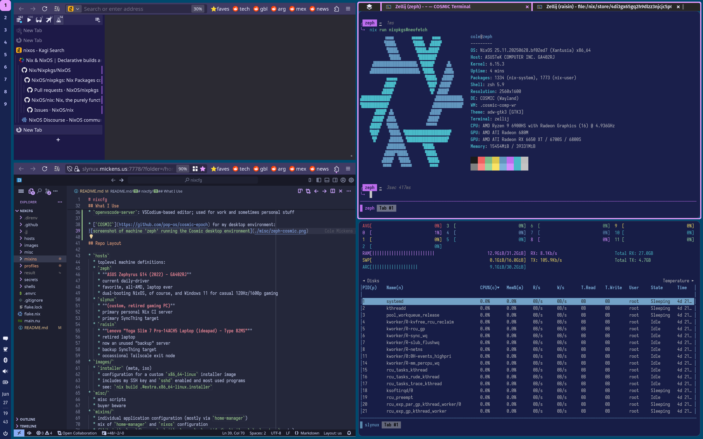

# nixcfg
*Nix rules everything around me*

- [nixcfg](#nixcfg)
  - [Overview](#overview)
  - [Components Used](#components-used)
    - [Extra Flake Inputs](#extra-flake-inputs)
  - [What I Use](#what-i-use)
  - [Repo Layout](#repo-layout)

## Overview

* nix configuration for my laptop, and old desktop server
* [**Determinate Nix**](https://docs.determinate.systems/determinate-nix/)-powered
* guaranteed to be **reproducible**
* **immutable** *full* system configuration (**dotfiles**, but on steroids)

## Components Used

* [`home-manager`](https://github.com/nix-community/home-manager) for user-based app/desktop configuration
* [`sops-nix`](https://github.com/Mic92/sops-nix) for secrets (encrypted at rest, per-host encryption)
* [`lanzaboote`](https://github.com/nix-community/lanzaboote) for bootloader configuration
* **[`determinate`](https://github.com/DeterminateSystems/determinate) for getting the best version of Nix with robust defaults**

### Extra Flake Inputs
* [`ucodenix`](https://github.com/e-tho/ucodenix) to try to upgrade microcode
* [`helix`](https://github.com/helix-editor/helix) for latest buids of [helix](https://github.com/helix-editor/helix) (rust-y modal TUI editor)
* [`jj`](https://github.com/jj-vcs/jj) for latest buids of [jj (jujutsu)](https://github.com/jj-vcs/jj) (`git` but actually good)
* [`zjstatus`](https://github.com/dj95/zjstatus) a nice plugin for [zellij](https://github.com/zellij-org/zellij) (rust-y user-friendly, powerful `tmux`-replacement)

## What I Use
* `helix`: my go-to editor; TUI, Rust, modal, built-in LSP, etc
* `zelij`: `tmux` but better, with excellent UX for beginners
* `firefox`: because Google should not own the web, and Sideberry is essential for tree-style tabs
* `openvscode-server`: VSCodium-based editor; used for work and sometimes personal stuff

* [`COSMIC`](https://github.com/pop-os/cosmic-epoch) for my desktop environment:

## Repo Layout

* `hosts` 
  * toplevel machine definitions:
  * `zeph`
    * **ASUS Zephyrus G14 (2022) - GA402RJ**
    * current daily-driver
    * favorite, all-AMD, laptop ever
    * dual-booting NixOS, of course, and Windows 11 for casual 120Hz/1600p gaming
  * `slynux`
    * **(custom, retired gaming PC)**
    * primary personal Nix CI server
    * primary SyncThing target
  * `raisin`
    * **Lenovo "Yoga Slim 7 Pro-14ACH5 Laptop (ideapad) - Type 82MS"**
    * retired laptop
    * now an unused "backup" server
    * backup SyncThing target
    * occassional Tailscale exit node
* `images/`
  * `installer` (meta, iso)
    * configuration for a custom `x86_64-linux` installer image
    * includes my SSH key and `sshd` enabled and most used programs
    * see: `nix build .#extra.x86_64-linux.installer`
* `misc/`
  * misc scripts
  * buyer beware
* `mixins/`
  * individual application configuration (mostly via `home-manager`)
  * mix of `home-manager` and `nixos` configuration
  * (`libvirt`, `prs`/`gopass`, `git`, `gnupg`, `spotifyd`, `tailscale`, `wezterm`, etc)
* `profiles/`
  * bits that compose machine "personas"
  * `core.nix` - core bits, see also `mixins/common.nix`
  * `interactive.nix` - headless systems
  * `gui.nix` - baseline for GUI systems
  * `gui-wayland.nix` - common tools for wayland/wlroots compositors
  * `gui-sway.nix` - the start of my `sway` GUI configuration
  * `addon-dev.nix` - pull devtool's shell deps into system
  * `addon-laptop.nix` - common laptop bits, power management, etc
  * `addon-asus.nix` - extras for my ASUS laptop
  * `user-cole.nix` - my base `cole` user configuration
* `secrets/`
  * scripts to manage `sops` for `sops-nix`
  * `sops-nix` is great...
  * but `sops` is questionable-code-quality near-abandonware
* `shells/`
  * nix shells for various scenarios
    * `_minimal.nix` - minimal shell base
    * `ci.nix` - tools needed to drive CI for this repo
    * `devenv.nix` - complete set of tools for Go/Rust/Nix development
    * `uutils.nix` - experimentation with rust-based coreutils
* `main.nu`
  * custom script for builds, deploys, etc
